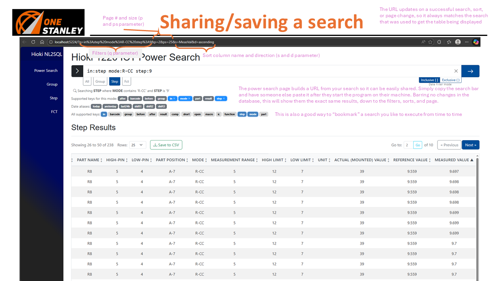
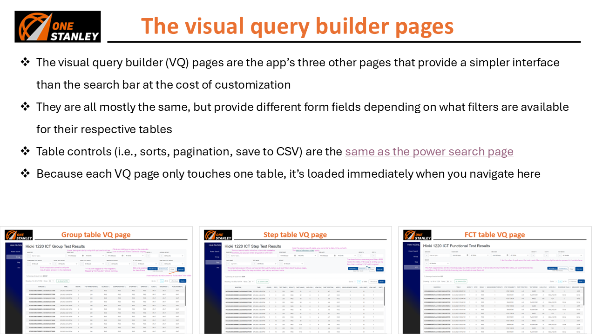

Using the Hioki Natural Language to SQL (NL2SQL) application
================

Quick Start
--------

*Note: all images used in this file are referenced from the PowerPoint also in this directory. For an abbreviated guide, use the PowerPoint.*  

Starting the program using `dotnet run` inside the project directory will start the app on `localhost:5224`. You can enter that into the address bar of any browser, and that should take you to the home page shown below.  

The left hand side of the page has tabs for navigation between the four pages: Group, Step, FCT, and Power Search. The group, step, and FCT pages are what are known as visual query builder pages (VQ pages) and provide a simpler interface at the cost of customizability and the "search all" feature. Please allow some loading time after navigating to a page for the first time as the browser loads the necessary table. Subsequent loads should be much faster, as they do not require more database queries. Refreshing the page un-loads the browser, so you can expect another slow load time after refreshing.  

It is recommended to use only the power search page, or only the VQ pages, as the power search page "borrows" the engines from the VQ pages, forcing additional reloads when navigating from VQ to power search or vice versa. Additionally, this means the VQ pages will have their fields automatically filled from the power search page. This is kind of cool (but mostly an artifact of the aforementioned engine borrowing).  

The power search page doubles as the home page, so when you first open it, there will be a message instructing you to use the search bar and keep an eye on the live preview. This message will be replaced by the result table after you've completed a search. This is not the case for the VQ pages, which automatically load the table when they are opened.  

Power Search
--------

*Terminology note: a 'tag' is any key-value pair usable in the search bar, while a 'filter' is the key from a tag that is not **in***  

The power search page consists of a search bar with table tabs, a preview, and interactable tags supported by the search bar (plus the result table itself). Any tag in dark gray can be clicked to be added to the search, and any tag can be hovered over to see a helpful tooltip containing details about what the tag does and which tables in which it is applicable. Clicking a tag will turn it blue to denote its presence in the search, and an X will appear for removing the tag.  

Once you're ready, use space-separated key:value syntax (e.g. `in:group comp:pass`) to specify your filters.  

The **in** tag is particularly special, because it determines which table(s) to search, and by extension, which filters are available. Without specifying an **in** tag, you search all tables, which can be helpful for a few cases, like tracking a barcode (`barcode:targ3txxbarc0d3`) or getting all non-passing test results during a certain shift (`-result:pass before:shift1 after:shift1` in inclusive mode), but your filters are limited to just the six core ones you see under "Supported keys in this mode".
To gain access to a filter, your **in** tag must target a table in which that filter has a column. If you're wondering which table(s) supports a specific filter, hover over the filter where it's listed in "All supported keys". If you're wondering what filters are supported by a specific table, just type `in:<table name>` and take a look at the newly populated key list in "Supported keys for this mode". For example, `step:3` will fail because the step filter is not supported by the group table (so all cannot be searched), but either `in:step step:3` or `in:fct step:3` works because both of those tables support the **step** tag  

Filters can filter *by* (default, find entries where values match what you specify) or filter *out* (find entries where the value you specify is absent) by appending a hyphen to the beginning of your key (e.g. `-group:1` finds every result belonging to a group that's not 1). This works for all tags except the **in** tag (because it determines membership, not details) and the before/after tags (because -before is equivalent to after, and vice versa). Using a nega-filter will turn it red in the tag list. This does not mean it is wrong, it is just a visual indicator that the filter is negated because hyphens are tiny.  

Values can be wrapped in quotes (specifically double quotes, `"`) in order to "escape" the special characters space ` ` and colon `:`. You're welcome to use quotes for any value, as they're just a grouping construct and will not affect the value you specify, but they are necessary when specifying a value for a filter which includes a space (e.g. date+time, some test modes) or a colon (e.g. time). If at any time there comes a point where it would be sufficiently advantageous to use a literal quote in a value, the regular expression in the parser could be amended to accept a different grouping construct (e.g. parentheses or other brackets) without much difficulty.  

Upon editing the search bar after executing a search, the table will fade to denote "staleness". This removes its interactablity until the next search is executed or the page is refreshed. Sometimes the table will appear stale even though it is not. I have no idea why this happens. Fortunately, a refresh or two will always fix this.  

Below is the table used across all four pages. It (ideally) behaves exactly the same way on each one. The most interesting feature that you won't find in similar search tools is what I refer to as the barcode "drill-down" Suppose you find a particularly interesting test result and you wish to learn more about that specific part. You can click on the barcode in question and you'll be sent to the power search page (if you're not already there, as this works on all four pages) with a query preloaded to search all for that barcode. This will show you all of the results (group, step, and FCT) associated with that barcode.  

For wider tables (step and FCT), use the horizontal scrollbar beneath the table or `Shift+scroll` while hovering over it to see the columns that are off-screen.

Dates and times (particularly shift aliases) almost require a separate guide of their own, because humans have a very strange perception of time. I will do my best to explain, but hopefully you will find this intuitive. To begin with, clicking a date alias adds it to the search. If there is a key awaiting a value at that time, only the alias will be appended. Otherwise, the tool assumes the after tag and appends `after:<alias`. Executing the search replaces all aliases with their interpreted value, increasing customizability in case of shifts on overtime, etc.  

Strictly speaking, the tool works best with full ISO datetimes in 24-hour time, but those get frustrating fast, so there is support for simplified dates (e.g. MM-DD, MM/D, MM/D-yy) and times (e.g. 1:04PM, but careful not to add a space between the time and A/PM or the tool doesn't recognize the time at all, even with quotes). All this goes to say, use the shorthand that works for you, but if you suspect the tool isn't understanding you, try ISO's "YYYY-MM-DD HH:mm:ss" (don't forget the quotes)  

Here are the rules for how alias substitution is applied (I'll cover how endpoints are resolved next):

- If a time (shift) alias is used without an accompanying date part, the app infers that you meant the most recent time that shift ran, including the current shift. For example, running a search on 2/25 at 10:47 would resolve:
  - shift1: 2/25, 7:00 to 15:29
  - shift2: 2/**24**, 15:30 to 22:29
  - shift3: 2/24, 22:30 to 2/25, 6:59
- If a time (not alias) is used without an accompanying date part, the app infers that you meant the most recent date that time occurred (as to avoid searching the future, which would certainly yield no results).
  - This means if that time has not yet occurred today, it will refer to yesterday at that time (e.g. `after:11:00` on 2/25 at 10:47 will search after 11:00 on 2/**24**).
  - As previously mentioned, this **must** be wrapped in quotes, otherwise the tool will not recognize it as a time but as a key (bad).
  - Semantically, this is a little unreliable, so if you want to specify a specific time, I'd recommend putting it with a date (below).
- If a date (or date alias) is used without an accompanying time part, the app infers that you want to cover the whole day. This is the most intuitive one.
- If a date is used with a time (either may or may not be an alias), all is well, as long as you put the date *before* the time, and the whole value is wrapped in quotes.
  - Please don't put the time before the date. You won't get an error, but the app will lose its mind. It should hopefully feel normal to specify time after date.

If you don't use a before/after tag (I recommend you do once the database fills up) or specify a clear time (not alias), the inclusive/exclusive toggle won't affect your search at all. If you use any alias, or use a date without a time (i.e. you specify what effectively represents a timespan), this little switch next to the clear and execute search buttons will determine whether the time span you specify is included or excluded (non-strict vs. strict inequality, &le; vs. &lt;). The rule of thumb is that an **after** tag, this always gets the beginning in inclusive mode and the end in exclusive mode, but **before** does the opposite: end in inclusive, beginning in exclusive. This should be intuitive.  

For shift aliases, the beginning and end are well defined:

- `shift1 - 07:00-15:29`
- `shift2 - 15:30-22:29`
- `shift3 - 22:30-06:59` (00:00-06:59 is on current day, 22:30-23:59 on previous day)
  - Suppose this is run on 1/10 (different to avoid confusion with the following example)
  - inclusive `before:shift3` = all entries before and including shift3 of 1/10: before 1/10 at 06:59  
  - exclusive `before:shift3` = all entries strictly before shift3 of 1/10: before 1/9 at 22:30  
  - inclusive `after:shift3` = all entries after and including shift3 of 1/10: after 1/9 at 22:30  
  - exclusive `after:shift3` = all entries strictly after shift3 of 1/10: after 1/10 at 06:59  

For dates, this just resolves to midnight or 11:59 (this applies to any date; here is an example)

- `2/25 - 2/25 00:00-2/25 23:59`  
  - inclusive `before:2/25` = all entries before and including 2/25: before 2/25 at 23:59  
  - exclusive `before:2/25` = all entries strictly before 2/25: before 2/25 at 00:00  
  - inclusive `after:2/25` = all entries after and including 2/25: after 2/25 at 00:00  
  - exclusive `after:2/25` = all entries strictly after 2/25: after 2/25 at 11:59  

Of course, this also works with date+shift alias specification (the times from the shift alias, offset by the date).

Non-fatal errors (warnings) are ones where the app thinks it understood what you meant and can automatically correct it, or that the result of excluding bad input would be close to what you wanted. This includes things like duplicate tags, negation where it shouldn't be, and tags missing a key or value.

Fatal errors are ones where you messed up in a way that the app can't automatically correct, and simply excluding the bad input would likely yield different results from what you wanted. This includes things like invalid target for the **in** tag, a mismatched tag for a table, and incorrect data type for a filter.

This is what it looks like when your search doesn't yield any results because your filters were too strict. Unless you get errors in addition to this screen, your syntax was fine, but nothing in the database matches your search criteria. There's a chance you trigger this one by simply searching the wrong table.

For every successful power search (i.e. no fatal errors), the page's URL will update to reflect the filter, sort, and page information. This way, if you find search results you'd like to share with someone else, you can copy the URL from the address bar and send it to someone else with the program. If the program is running on their machine, they can just paste it into their address bar and immediately see the results of your search. This is also a great way to "save" a favorite search that you like to run every now and then. In either case, just remember the page number will change over time as more entries are added to the database.

VQ Pages
---------

The VQ pages are exactly the same as the power search page under the hood, just with an interface that's easier to learn. If you don't care about having absolute control over the fine tuning of your filters, this is a great way to pick up the app and get the results you want. The two biggest limitations of the VQ pages are the inability to search all tables and the inability to specify a time (outside of shift aliases), so if that's not a problem, this is for you! The table operates exactly the same as it does on the power search page, just without an updating URL.

