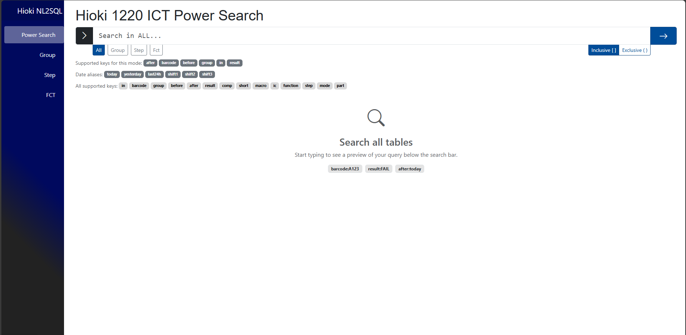
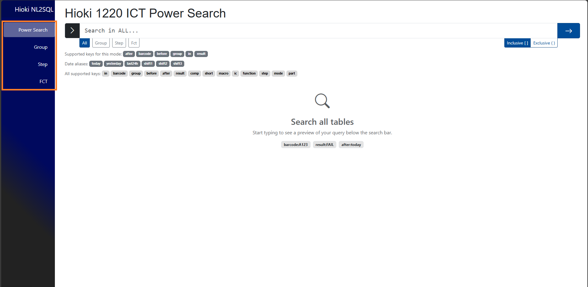

Using the Hioki Natural Language to SQL (NL2SQL) application
================

Quick Start
--------
Starting the program using `dotnet run` inside the project directory will start the app on `localhost:5224`. You can enter that into the address bar of any browser, and that should take you to the home page shown above. 
The left hand side of the page has tabs for navigation between the four pages: Group, Step, FCT, and Power Search.

